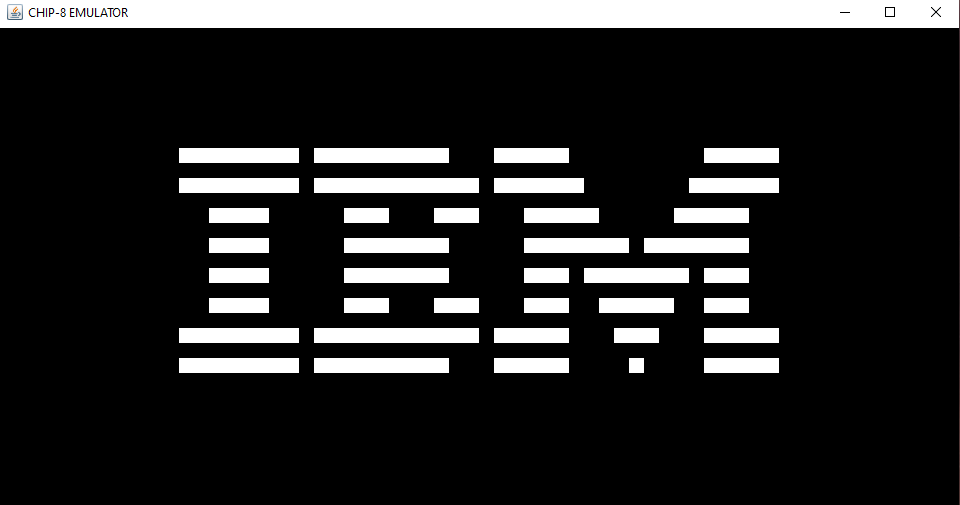

# Chip-8 Emulator

Interpreter for Chip-8 programming language built as an entry into emulator development implemented in Java. 
Implements most of the features of a Chip-8 virtual machine; the exceptions being working audio 
and consistent 60hZ timers.

## About Project

Chip-8 is one of the most common starter projects for beginning emulator development. This project was built
with intentions to have a better understanding of how emulators are built as I move on to building more complex 
systems.

### Lessons Learned

Many concepts that I haven't used in a practical application were used while developing this project, such
as bitwise operations and game loops. Majority of the debugging was spent learning to 
correctly set the display's pixels from the display instruction and sprites in memory. Although this project
isn't a perfectly accurate interpreter since it does not feature working audio or consistent timers, I 
was able to learn how the CPU interacts with memory, the display, and the keyboard to make a functional system.

## Usage

Navigate to Chip8.java file in /main/src and run main(). 
Any included .ch8 ROMs should be placed in /roms folder.

Update ticks per second will vary per ROM for optimal usage.

 

## Credits

- [Chip-8 Test Suite](https://github.com/Timendus/chip8-test-suite)
- [Chip-8 Emulator Reference](https://tobiasvl.github.io/blog/write-a-chip-8-emulator/)

